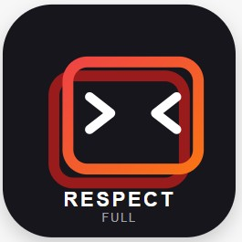
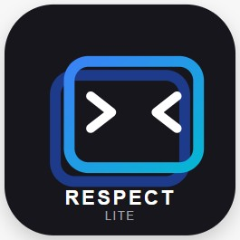

# ⚡ Respect Desktop

[](https://github.com/milio48/respect/releases)
[](LICENSE)
[](https://github.com/milio48/respect)
[](https://go.dev)

**Respect Desktop** adalah aplikasi Windows praktis untuk mengubah situs website, web app, atau file HTML menjadi aplikasi desktop (`.exe`) mandiri siap pakai — **hanya dengan beberapa klik, tanpa perlu install server, Node.js, atau coding tambahan!**

---

## ⚡ Unduh Langsung (Siap Pakai, Cukup 1 File .EXE)

Langsung unduh edisi yang sesuai kebutuhan Anda tanpa perlu membaca dokumentasi teknis:

| <a href="https://github.com/milio48/respect/releases"><br><b>Respect Modern (`respect.exe`)</b></a> | <a href="https://github.com/milio48/respect/releases"><br><b>Respect Lite (`respect-lite.exe`)</b></a> |
| :---: | :---: |
| 🌟 **Pilihan Terbaik & Paling Direkomendasikan**<br>Mendukung web modern, Tailwind CSS, animasi halus, dan visual kaya *(Chromium 132)*. | 🪶 **Paling Ringan & Hemat Memori RAM**<br>Sangat enteng, minim RAM, cocok untuk aplikasi kasir atau komputer lawas *(Miniblink 49)*. |
| [⬇️ **Unduh Edisi Modern (64-bit)**](https://github.com/milio48/respect/releases)<br>*(Windows 7, 8, 10, 11)* | [⬇️ **Unduh Edisi Lite (32/64-bit)**](https://github.com/milio48/respect/releases)<br>*(Windows XP s.d. 11)* |

> 💡 **Cara Pakai:** Cukup unduh salah satu file `.exe` di atas, klik ganda untuk membuka builder, masukkan link web Anda, dan klik **Build**. Selesai!

---

## 🎯 Perbandingan Detail Edisi

Respect siap pakai langsung setelah diunduh (tidak perlu proses install):

| Fitur | 🌟 **Respect Modern (`respect.exe`)** | 🪶 **Respect Lite (`respect-lite.exe`)** |
|---|---|---|
| **Kelebihan** | Mendukung web modern, tampilan mulus & animasi kaya | Ringan, hemat memori & kompatibilitas sistem lawas |
| **Bentuk Distribusi** | **1 File `.exe` Mandiri** (Single Binary) | **1 File `.exe` Mandiri** (Single Binary) |
| **Ukuran File Biner** | **~72 MB** *(seluruh engine terintegrasi)* | **~57 MB** *(seluruh engine terintegrasi)* |
| **Engine Browser** | Chromium 132 (Lebih baru & Cepat) | Miniblink 49 (Ringan & Hemat RAM) |
| **Dukungan Windows** | Windows 7, 8, 10, 11 (64-bit) | Windows 7, 8, 10, 11 (64-bit)* / XP s.d. 11 (32-bit)* |
| **Paling Cocok Untuk** | Dashboard modern, aplikasi SaaS, grafik interaktif | Aplikasi kasir (POS), utilitas kantor, komputer lawas |

> **💡 Panduan Cepat:**
> - Jika ingin tampilan web masa kini terbaik: **Gunakan `respect.exe`**.
> - Jika ingin binary yang lebih hemat memori atau untuk komputer lama: **Gunakan `respect-lite.exe`**.
> - Kedua edisi merupakan **single binary mandiri** (cukup 1 file `.exe`, langsung jalan tanpa perlu instalasi atau file tambahan).

<details>
<summary>📊 <b>Lihat Hasil Uji Kapabilitas & Komparasi Fitur (Hasil Riset 88 Standar Web)</b></summary>

Berdasarkan pengujian komparasi terhadap 88 fitur standar web modern (JavaScript, CSS, HTML5, dan PWA):

| Kategori Pengujian | 🪶 Respect Lite (v49) | 🌟 Respect Modern (v132) | Catatan Penting |
|---|---|---|---|
| **JavaScript** | **19/24** (79%) | **24/24** (100%) | Modern lulus penuh standar ES2020+ (Optional Chaining `?.`, Nullish Coalescing `??`, ES Modules, WeakRef). |
| **CSS Modern** | **6/22** (27%) | **22/22** (100%) | **Perbedaan Terbesar:** Lite tidak mendukung CSS Grid, CSS Variables (`--var`), `backdrop-filter`, `gap`, `aspect-ratio`, `:has()`. Modern mendukung penuh framework seperti Tailwind CSS. |
| **HTML5 Core** | **18/32** (56%) | **21/32** (66%) | Keduanya mendukung Canvas, Web Audio, SVG, Web Workers, dan LocalStorage. |
| **PWA & OS APIs** | **1/10** (10%) | **3/10** (30%) | Keterbatasan arsitektur embedded webview desktop: API tingkat OS seperti Cache API, Background Sync, dan Push Notifications tidak diekspos secara native. |
| **TOTAL SKOR** | **44 / 88 (50.0%)** | **70 / 88 (79.5%)** | **Modern unggul mutlak pada rendering tampilan visual & kompatibilitas library web.** |

> [!TIP]
> **Rekomendasi Pemilihan:**
> - **Pilih `respect.exe` (v132):** Wajib jika situs/aplikasi web Anda memakai framework frontend modern (React, Vue, Tailwind CSS, Svelte), grafik interaktif, atau animasi CSS modern.
> - **Pilih `respect-lite.exe` (v49):** Sangat ideal untuk web app sederhana, aplikasi kasir (POS), utilitas internal, atau komputer dengan RAM terbatas dan Windows lawas (Windows 7/8).

</details>

---

## 🚀 Cara Menggunakan (Sangat Mudah!)

1. **Unduh file executable** (`respect.exe` atau `respect-lite.exe`) dari halaman [GitHub Releases](https://github.com/milio48/respect/releases).
2. **Klik ganda file `.exe`** yang telah diunduh untuk membuka builder.
3. **Isi formulir pembuatan**:
   - Masukkan alamat web (contoh: `https://aplikasisaya.com`) atau pilih file HTML lokal Anda.
   - Beri nama aplikasi Anda (contoh: `AplikasiSaya.exe`).
   - *(Opsional)* Pilih gambar icon `.ico` Anda sendiri.
4. Klik tombol hijau **Build Standalone EXE**.
5. **Selesai!** File `.exe` buatan Anda langsung jadi di folder yang sama dan siap digunakan atau dibagikan ke siapa saja.

---

## 💡 Fitur Lanjutan (Opsional)

<details>
<summary>💻 <b>Klik di sini jika ingin menggunakan Baris Perintah (CLI) untuk Otomasi</b></summary>

Bagi Anda yang ingin membuat file `.exe` secara otomatis melalui script Command Prompt atau PowerShell:

```powershell
# Cek versi aplikasi
.\respect.exe --version

# Buat aplikasi langsung dari URL website
.\respect.exe --build --source "https://google.com" --out "GoogleDesktop.exe" --title "Google"

# Buat aplikasi dari file HTML lokal dengan ukuran jendela tertentu
.\respect.exe --build --source "C:\proyek\index.html" --mode file --width 1280 --height 800 --out "Dashboard.exe"

# Buat aplikasi lengkap dengan icon, versi, dan metadata pengembang/perusahaan
.\respect.exe --build --source "https://my-app.com" --icon "icon.ico" --out "MyApp.exe" `
  --app-version "1.2.0" --company "PT Solusi Digital" --copyright "Copyright © 2026"
```

### Parameter CLI
- `--build` : Mengaktifkan pembuatan file executable dari terminal
- `--source` : URL website atau path file HTML
- `--out` : Nama file output (default: `demo.exe`)
- `--title` : Judul jendela aplikasi
- `--width` / `--height` : Ukuran jendela awal aplikasi
- `--icon` : Path file icon `.ico` (opsional)
- `--app-version` : Nomor versi aplikasi (default: `1.0.0`)
- `--company` : Nama perusahaan atau pengembang (opsional)
- `--copyright` : Teks hak cipta / copyright (opsional)
- `--version` : Cek versi engine dan edisi yang aktif

</details>

---

## 🛠️ Area Pengembang (Developer & Source Code)

<details>
<summary>🔧 <b>Klik di sini untuk Panduan Kompilasi dari Source Code & Kontribusi</b></summary>

### Prasyarat
- Sistem Operasi: **Windows 10/11 (64-bit)**
- **Go 1.25+**
- PowerShell 5.1+
- Git: `git clone https://github.com/milio48/respect.git`

---

### Cara Kompilasi (Build) Lokal

```powershell
# Clone repository
git clone https://github.com/milio48/respect.git
cd respect
```

> 💡 **Catatan Development:** Selama fase pengembangan (development) v132, engine Miniblink 132 dijalankan dalam mode slim dengan memuat `blink.dll` di samping binary untuk mempercepat proses kompilasi dan iterasi lokal.

#### 1. Menggunakan Skrip PowerShell Otomatis
```powershell
# Bangun kedua edisi sekaligus ke folder dist/
.\scripts\build.ps1 -Target all

# Bangun hanya Respect Modern (respect.exe)
.\scripts\build.ps1 -Target modern

# Bangun hanya Respect Lite (respect-lite.exe)
.\scripts\build.ps1 -Target lite
```

#### 2. Menggunakan Perintah Go Manual
```powershell
# Respect Modern (Chromium 132)
go build -tags v132 -ldflags="-s -w -H windowsgui" -o respect.exe .

# Respect Lite (Miniblink 49)
go build -ldflags="-s -w -H windowsgui" -o respect-lite.exe .
```

---

### Struktur Repository

```
respect/
├── .github/workflows/   # CI/CD GitHub Actions untuk rilis Windows otomatis
├── assets/              # Icon resmi (respect-full.ico & respect-lite.ico) serta rcedit.exe
├── internal/
│   ├── builder/         # UI Builder GUI (builder_v132.go & builder_v49.go)
│   │   └── static/      # Frontend Builder (HTML/CSS/JS mandiri, dual-IPC)
│   ├── icon/            # Injeksi icon aplikasi via Windows PE Resource
│   ├── mb132/           # Wrapper Miniblink 132 pure Go (VEH crash handler & sandbox)
│   ├── payload/         # Shared trailer engine format RESPECTv1 (100% kompatibel)
│   ├── runtime/         # Runtime runner (runtime_v132.go & runtime_v49.go)
│   └── version/         # Sentralisasi versioning (version_v132.go & version_v49.go)
├── scripts/             # Skrip automasi build lokal (build.ps1)
└── main.go              # Shared CLI parser & application entry point
```

---

### Otomasi Rilis GitHub Actions
Workflow rilis tersedia di `.github/workflows/release.yml`. Ketika tag versi dibuat (misal `git tag v1.0.0 && git push origin v1.0.0`), GitHub Actions akan:
1. Mengompilasi `respect.exe` dan `respect-lite.exe` di mesin Windows runner.
2. Menyuntikkan icon aplikasi resmi Respect.
3. Mengarsipkan bundel `.zip` untuk rilis.
4. Menerbitkan aset secara otomatis ke GitHub Releases.

</details>

---

## 📄 Lisensi
Didistribusikan di bawah lisensi MIT. Lihat file [LICENSE](LICENSE) untuk informasi lebih lanjut.
