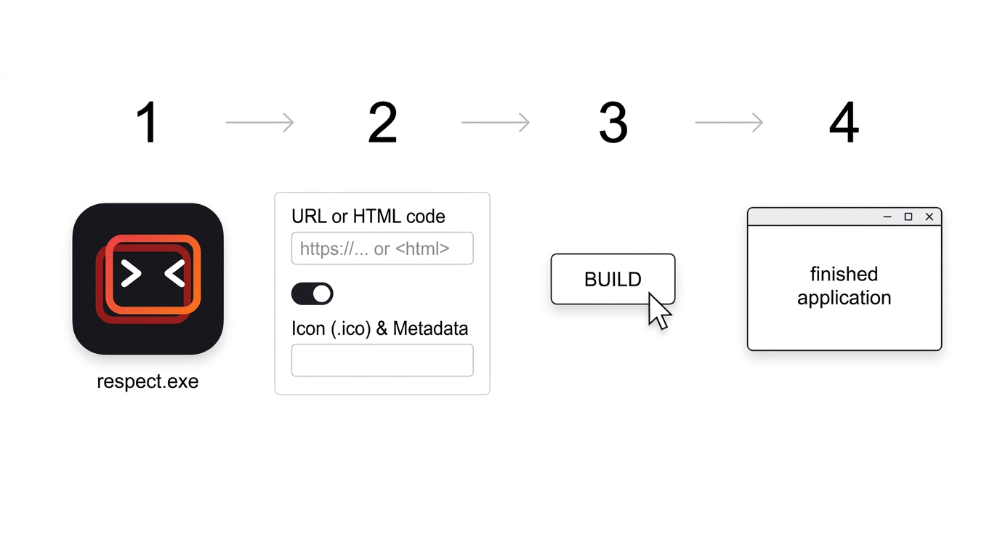
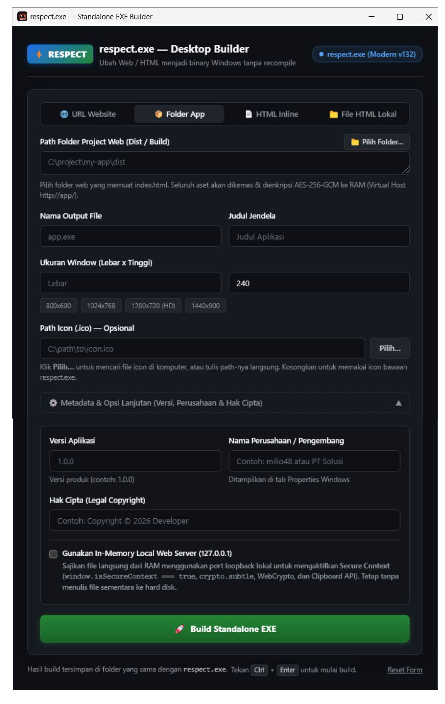

# ⚡ Respect Desktop

[](https://github.com/milio48/respect/releases)
[](LICENSE)
[](https://github.com/milio48/respect)
[](https://go.dev)
[](docs/index.md)

<p align="center">
  
</p>

<p align="center">
  
  <br>
  <em>Tampilan GUI Desktop Builder — ubah web/HTML menjadi .exe hanya dalam beberapa detik</em>
</p>

**Respect Desktop** adalah utilitas Windows praktis untuk mengubah situs website, folder aplikasi web (React, Vue, Svelte, Vite), atau file HTML menjadi aplikasi desktop (`.exe`) mandiri siap pakai — **hanya 1 file `.exe`, tanpa perlu instalasi server, Node.js, atau coding tambahan!**

---

## ⚡ Unduh (Siap Pakai, Cukup 1 File .EXE)

Langsung unduh edisi executable yang sesuai dengan kebutuhan Anda:

| <a href="https://github.com/milio48/respect/releases"><br><b>Respect Modern (`respect.exe`)</b></a> | <a href="https://github.com/milio48/respect/releases"><br><b>Respect Lite (`respect-lite.exe`)</b></a> |
| :---: | :---: |
| 🌟 **Pilihan Terbaik & Paling Direkomendasikan**<br>Mendukung web modern, Tailwind CSS, animasi halus, dan visual kaya *(Chromium 132)*. | 🪶 **Paling Ringan & Hemat Memori RAM**<br>Sangat enteng (~25–40 MB RAM), cocok untuk aplikasi kasir atau PC lawas *(Miniblink 49)*. |
| [⬇️ **Unduh Edisi Modern (64-bit)**](https://github.com/milio48/respect/releases)<br>*(Windows 7, 8, 10, 11)* | [⬇️ **Unduh Edisi Lite (32/64-bit)**](https://github.com/milio48/respect/releases)<br>*(Windows XP s.d. 11)* |

> 🎮 **Ingin mencoba performa & kapabilitas engine langsung?**
> Unduh file demo siap jalan di halaman Releases: [**`demo-stress-testing.exe`** (Modern)](https://github.com/milio48/respect/releases) atau [**`demo-stress-testing_lite.exe`** (Lite)](https://github.com/milio48/respect/releases) untuk menguji 120+ standar web, audio oscilloscope, kamera, dan simulasi fisika 20.000 partikel 60 FPS.

---

## 🚀 Contoh Penggunaan

### 1. Antarmuka Visual (Desktop GUI Builder)

1. Unduh `respect.exe` atau `respect-lite.exe`, lalu **klik ganda (double-click)** untuk membukanya.
2. Pilih mode sumber:
   - **URL Website**: Masukkan URL (contoh: `https://aplikasisaya.com`).
   - **Folder App V2 (In-Memory)**: Pilih folder hasil build aplikasi web frontend (contoh: folder `dist/` atau `build/` dari Vite/React).
   - **File HTML Lokal**: Pilih file `.html` dari komputer Anda via tombol **Pilih Folder/File…**.
   - **HTML Inline**: Tempel langsung kode HTML/CSS/JS.
3. Beri nama aplikasi (contoh: `AplikasiSaya.exe`) dan tentukan icon `.ico` (opsional).
4. Klik **Build Standalone EXE**. File `.exe` baru langsung jadi dan siap didistribusikan!

### 2. Baris Perintah (CLI untuk Automasi)

Jalankan perintah langsung dari Command Prompt atau PowerShell:

```powershell
# 1. Buat aplikasi dari URL website
.\respect.exe --build --source "https://aplikasisaya.com" --out "AplikasiSaya.exe" --title "Aplikasi Saya"

# 2. Buat aplikasi dari folder web frontend (In-Memory Virtual Host V2)
.\respect.exe --build --source "C:\proyek\my-vite-app\dist" --mode folder --out "Dashboard.exe"

# 3. Buat aplikasi dari file HTML lokal dengan icon kustom & ukuran jendela
.\respect.exe --build --source "C:\proyek\index.html" --mode file --icon "assets\icon.ico" --width 1280 --height 800 --out "POSApp.exe"
```

---

## 📚 Dokumentasi Lengkap

Untuk panduan mendalam mengenai fitur teknis, parameter CLI lanjutan, arsitektur, dan cara kompilasi dari source code, silakan baca dokumentasi kami:

- 📖 **[Pusat Dokumentasi Utama (`docs/index.md`)](docs/index.md)**
- 📘 **[1. Panduan Penggunaan Lengkap](docs/1-panduan-penggunaan.md)** — GUI Builder, dialog native, drag & drop, serta daftar parameter CLI.
- 📊 **[2. Perbandingan Edisi & Riset 88 Standar Web](docs/2-perbandingan-edisi.md)** — Komparasi detail Chromium 132 vs Miniblink 49.
- 🔒 **[3. Arsitektur In-Memory Virtual Host & Enkripsi](docs/3-arsitektur-virtual-host.md)** — Runtime zero-disk, zero-socket port, dan enkripsi payload AES-256-GCM.
- ⚙️ **[4. Lifecycle & Alur Eksekusi Internal](docs/4-lifecycle.md)** — Threading model, window hooks, Win32 message loop, dan self-replication.
- 🛠️ **[5. Panduan Pengembang & Kompilasi](docs/5-panduan-pengembang.md)** — Prasyarat, skrip `build.ps1`, Go build tags, dan CI/CD GitHub Actions.
- 🧭 **[6. Kompatibilitas Standar Web, Media & Batasan Engine](docs/6-kompatibilitas-dan-batasan-engine.md)** — Pemutaran media native (MP4/H.264), Secure Context, dan batas nyata engine.


---

## 🔗 Kredit & Tautan Komunitas

Respect Desktop dapat terwujud berkat karya luar biasa dari komunitas open source:
- **Core Engine C++**: [Miniblink 49](https://github.com/weolar/miniblink49/) oleh **Weolar** — dilisensikan di bawah [Apache License 2.0](https://www.apache.org/licenses/LICENSE-2.0). Binary Respect Desktop menyertakan DLL Miniblink secara tertanam (*embedded*).
- **Go Binding Miniblink**: [epkgs/blink](https://github.com/epkgs/blink) — dilisensikan di bawah [MIT License](https://github.com/epkgs/blink/blob/main/LICENSE).

---

## 📄 Lisensi

Didistribusikan di bawah lisensi [MIT](LICENSE). Hak Cipta © 2026 Respect Desktop Contributors.
